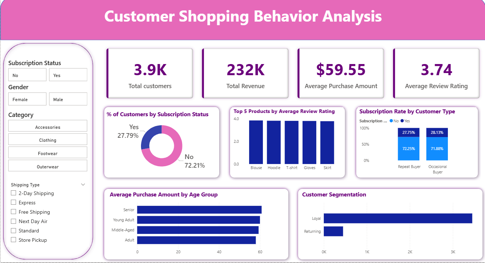

# 🛍️ Customer Shopping Behavior Analysis

## 📌 Project Overview

This project analyzes customer shopping behavior to understand purchasing patterns, customer segments, product performance, subscription behavior, and factors influencing purchase activity.

The project combines **Python, SQL, and Power BI** to transform raw customer shopping data into business-focused analysis and an interactive dashboard.

The analysis was designed to answer practical business questions around **customer behavior, revenue, product performance, customer segmentation, and subscription activity**.

---

## 🎯 Business Questions

The analysis focuses on questions such as:

* Which product categories generate the most revenue?
* What is the average purchase amount across different customer groups?
* Which products receive the highest customer ratings?
* How does subscription behavior differ between customer types?
* How are customers distributed across different segments?
* Which age groups have higher average purchase amounts?
* How do purchasing patterns differ across customer characteristics?

---

## 🛠️ Tools & Technologies

* **Python** — Data analysis and exploratory analysis
* **Pandas** — Data manipulation and aggregation
* **NumPy** — Numerical analysis
* **Matplotlib** — Data visualization
* **SQL / MySQL** — Business analysis and querying
* **Power BI** — Interactive dashboard and data visualization
* **CSV** — Source dataset

---

## 🔎 Python Analysis

Python was used to explore customer purchasing behavior and identify patterns across different dimensions.

The analysis included:

* Average purchase amount by product category
* Average purchase amount by age group
* Average purchase amount by gender
* Average purchase amount by season
* Product-level purchasing analysis
* Customer behavior analysis
* Exploratory visualizations

The Python notebook is available in:

`Customer_Shopping_Behavior_Analysis.ipynb`

---

## 🗄️ SQL Analysis

SQL was used to perform business-oriented analysis on the customer shopping dataset.

The analysis included:

* Revenue analysis by category
* Customer spending analysis
* Product rating analysis
* Shipping type comparison
* Subscription analysis
* Discount analysis
* Customer segmentation
* Product ranking by category
* Repeat buyer and subscription analysis
* Revenue analysis by age group

The SQL queries are available in:

`Customer_Shopping_Behavior_Analysis.sql`

---

## 📊 Power BI Dashboard

The Power BI dashboard brings the analysis together into an interactive report.

### Dashboard includes:

* Total Customers
* Total Revenue
* Average Purchase Amount
* Average Review Rating
* Subscription Status analysis
* Top 5 Products by Average Review Rating
* Subscription Rate by Customer Type
* Average Purchase Amount by Age Group
* Customer Segmentation
* Interactive filters for:

  * Subscription Status
  * Gender
  * Category
  * Shipping Type
 
  

The Power BI report is available in:

`Customer_Shopping_Behavior_Analysis.pbix`

---

## 💡 Key Insights

The analysis helps identify:

* Differences in purchasing behavior across customer groups
* Revenue contribution across product categories
* Products receiving higher customer ratings
* Subscription patterns among different customer types
* Differences in average purchase amounts across age groups
* Distribution of customers across behavioral segments
* Areas where customer behavior can be explored further for business decisions

---

## 📁 Project Files

| File                                        | Description                        |
| ------------------------------------------- | ---------------------------------- |
| `Customer_Shopping_Behavior_Analysis.csv`   | Raw customer shopping dataset      |
| `Customer_Shopping_Behavior_Analysis.ipynb` | Python analysis and visualizations |
| `Customer_Shopping_Behavior_Analysis.sql`   | SQL business analysis queries      |
| `Customer_Shopping_Behavior_Analysis.pbix`  | Interactive Power BI dashboard     |
| `README.md`                                 | Project documentation              |

---

## 🎯 Skills Demonstrated

This project demonstrates practical skills in:

* Data cleaning and exploration
* Python / Pandas
* NumPy
* Data aggregation
* Data visualization
* SQL querying
* GROUP BY and filtering
* CTEs and window functions
* Business-oriented analysis
* Customer segmentation
* KPI analysis
* Power BI dashboard development
* Data storytelling
* Translating data into business insights

---

## 💼 Business Recommendations

Based on the analysis, the following business actions could be explored:

### 1. Strengthen subscription engagement

The analysis shows a relatively low overall subscription share compared with non-subscribers. The business could test clearer subscription benefits, targeted offers, or personalized incentives to encourage more customers to subscribe.

### 2. Focus on high-performing product categories

Clothing and Accessories contribute a larger share of revenue than the other categories in the dataset. These categories could be analyzed further to understand which products, customer groups, and purchasing patterns are driving their performance.

### 3. Investigate customer retention opportunities

The customer segmentation analysis shows a much larger Loyal customer group than Returning customers. Further analysis could identify what differentiates these groups and help design campaigns aimed at increasing repeat purchasing.

### 4. Use customer segmentation for targeted marketing

Different customer groups show different purchasing behaviors. Marketing campaigns could be tailored by customer segment, age group, product preference, and subscription status rather than using the same offer for every customer.

### 5. Monitor product ratings alongside sales

High-rated products can provide useful signals about customer satisfaction. Combining product ratings with sales and revenue data could help identify products that are both well-received and commercially important.

### 6. Explore age-group purchasing patterns

Average purchase amounts vary across age groups. The business could use these differences to test age-specific product recommendations, promotions, and marketing strategies.

---

## 🚀 Project Objective

The objective of this project is to demonstrate an end-to-end data analytics workflow:

**Raw Data → Python Exploration → SQL Analysis → Power BI Dashboard → Business Insights**

The project focuses on applying analytical skills to a realistic business dataset rather than only demonstrating individual technical concepts.
